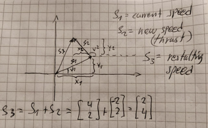

# rusty-asteroids: experiments with the rusty-engine

After having finished the first `road-race` exercise
in the `Ultimate Rust 2` course, I wanted to try and
see if I could write a simple `Asteroids` game.

## Install and run

After cloning, download the assets:

    cd rusty-asteroids
    curl -L https://github.com/CleanCut/rusty_engine/archive/refs/heads/main.tar.gz | tar -zxv --strip-components=1 rusty_engine-main/assets

then compile and run:

    cargo run
    
## Controls

Shots are fired with `SPACE`, thrust is given with the `UP` key 
and rotation is done by the `LEFT` and `RIGHT` key.

## Some notes

First I started to think about shooting projectiles from the Ship.
From the `Rusty Engine` I could get the rotation, in Radians, of
the Player. Assuming the projectiles travels with a certain speed
I should be able to calculate the movement in (x,y).


The code became very simple, the `SHOT_SPEED` times a scaling factor
times the cos/sin of the rotation angle got me the additional (x,y)
to be added to the current position:

``` rust
    // Move the shots
    for sprite in engine.sprites.values_mut() {
        if sprite.label.starts_with("shot") {
            sprite.translation.x +=
                SHOT_SPEED * engine.delta_f32 * (sprite.rotation as f64).cos() as f32;
            sprite.translation.y +=
                SHOT_SPEED * engine.delta_f32 * (sprite.rotation as f64).sin() as f32;
        }
    }
```

Next, I wanted to move the ship like in space. I imagined
that movements in space behave somewhat similar to a boat,
i.e you can't do sharp turns and have to rotate in combination
with using the rockets to control the direction you move in.

Assuming the ship moves in one direction with speed S1,
then that translates to some movements in (x,y) for each 
frame in the game. If the ship rotates and give some thrust
to the rockets, a new speed component (vector) adds to the
existing speed vector. The sum of those vectors forms the
new speed vector that represent the new movements (x,y)
to be performed in the succeeding frames.



The code became almost identical; the current speed of the
ship speed as (x,y) is kept in the game state. Then we just
add the new speed vector according to our rotation angle.
Note that if no new thrust was given, we then just continue
in the same speed as before. 

``` rust
    // Give thrust
    if give_thrust {
        game_state.speed.x += THRUST_SPEED * (player_rotation as f64).cos() as f32;
        game_state.speed.y += THRUST_SPEED * (player_rotation as f64).sin() as f32;
    }
    // Move the player
    player.translation.x += game_state.speed.x * engine.delta_f32;
    player.translation.y += game_state.speed.y * engine.delta_f32;
```

The Meteoroids was positioned randomly. Also, the scale, rotation
(i.e the direction of movement), and the speed was randomly generated.

``` rust
    sprite.scale = thread_rng().gen_range(0.1..1.0);
    sprite.rotation = thread_rng().gen_range(0.0..TAU);
    ...
    let speed = METEOROID_SPEED * thread_rng().gen_range(0.5..1.5) as f32;
    sprite.translation.x += speed * engine.delta_f32 * (sprite.rotation as f64).cos() as f32;
    sprite.translation.y += speed * engine.delta_f32 * (sprite.rotation as f64).cos() as f32;
```

To avoid placing meteoroids on top of the Player position I looped
until I got a position sufficiently far away. The friendly compiler
(it is incredibly helpful) suggested a neat compact range test. 

``` rust
    'random: loop {
        x = thread_rng().gen_range(game_state.min_x..game_state.max_x);
        y = thread_rng().gen_range(game_state.min_y..game_state.max_y);
        if !(-30.0..30.0).contains(&x) && !(-30.0..30.0).contains(&y) {
            break 'random;
        }
    }
```

To get the Thrust and Shooting to behave smoothly I needed to slow down
how fast they could react. This was done by making use of some `Timer`
structs stored in the game state that count down every frame. When they
reach zero it is ok to react to either a thrust, or shoot, command.

``` rust
    // As setup in the game state
    shot_timer: Timer::new(Duration::from_millis(RELOAD_TIME), false),
    thrust_timer: Timer::new(Duration::from_millis(THRUST_TIME), false),
    ...
    // Update the timers every frame
    game_state.shot_timer.tick(engine.delta);
    game_state.thrust_timer.tick(engine.delta);
    ...
    // Keyboard handling
    if engine.keyboard_state.pressed(KeyCode::Space) && game_state.shot_timer.finished() {
        shoot = true;
        game_state.shot_timer.reset(); // restart the timer
    }
```


The game is over when the Player collides with a Meteoroid and the 
game is won when all meteoroids are destroyed. The latter gave me 
some unexpected problems. I could not find an easy way to extract
if one meteoroid had been shot. I ended up keeping a `Vec<String>`
of the names of the meteoroid sprites. The final problem that
took some time to figure out was how to remove the destroyed names
from the Vector.

``` rust
    // deal with collisions
    for event in engine.collision_events.drain(..) {
        ...
        
        // Remove any destroyed meteoroid from our "alive" list.
        game_state.meteoroids.retain(|x| *x != event.pair.0);
        game_state.meteoroids.retain(|x| *x != event.pair.1);
        ...
    }
    ...
    // check for won game
    if game_state.meteoroids.is_empty() {
        ...
    }
```

To finish it off I made it possible to restart the game and to maintain
a Best Time high score. This was a very fun exercise and it is quite addictive
to play some `rusty-asteroids`... :-)
